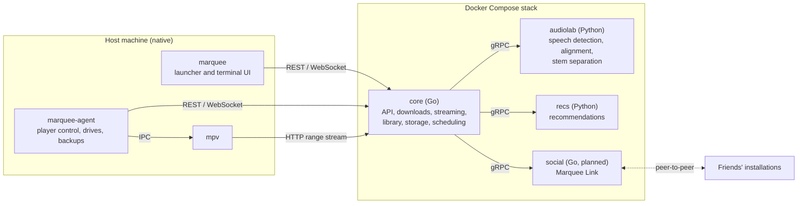

# Marquee

Marquee is a local-first media system with a terminal interface. It finds and downloads films and series, starts playback while the download is still in progress, keeps subtitles in sync automatically, and recommends what to watch next. Friends' installations connect directly to each other, without a central server, for synchronized co-watching and shared recommendations.

> **Project status:** early development. The repository contains the service skeleton, container stack and host launcher. Feature work follows the [roadmap](docs/roadmap.md).

---

## Overview

Most media tools solve one part of the problem: a download client, a library server, a subtitle manager or a player. Marquee combines them into one system built around three constraints:

- **Playback must start immediately.** Files are downloaded in playback order and streamed to the player as pieces arrive. Video is never re-encoded during playback.
- **Everything runs locally.** The full stack runs on the user's own machine with Docker Compose. No account, cloud service or hosted backend is required.
- **Features must work on ordinary hardware.** Every feature has a CPU path. A GPU is detected and used automatically when present, but it is never required.

## Features

| Area | Description |
|---|---|
| Streaming while downloading | Pieces are prioritized around the playback position. A range-capable HTTP server delivers them to the player as soon as they arrive, so seeking works before the download completes. |
| Automatic subtitle synchronization | A fast pass aligns speech activity with subtitle timing to correct constant offsets and frame-rate drift. A second pass matches speech-to-text word timestamps against the subtitle text and fits a piecewise correction for re-cut or edited releases. Corrections are applied to the running player. |
| Playback | mpv is the primary player, controlled over its IPC interface. A browser player is available as an alternative and uses direct play or remuxing only. |
| Library and metadata | Metadata from TMDB, a consistent library layout, continue-watching with resume points, and a "previously on" summary for the next episode. |
| Recommendations | Content embeddings combined with collaborative filtering, re-ranked for diversity. Each recommendation carries an explanation. Profiles keep separate taste models. |
| Storage management | Files move through tiers: pinned, hot, warm, cold and evicted. Unused tracks are removed losslessly. Watched titles can be re-encoded while the machine is idle, with a quality check before the original is replaced. Titles marked as favorites are never removed. |
| Dialogue enhancement | Real-time processing raises speech and controls loud effects. Optional source separation produces independent dialogue, music and effects levels. |
| Marquee Link | Peer-to-peer connections between installations, paired once with a QR code and a verification code. Enables co-watching with synchronized playback, live chat, a friend activity feed and shared recommendations. Only viewing metadata is exchanged, never media files. |
| Backup | Database snapshots, configuration and subtitle data can be backed up to cloud storage or an external drive. |

## Architecture



All server-side logic, including ffmpeg and the Python services, runs in containers on every platform. Two small native programs handle what containers cannot: the launcher and terminal interface, and the host agent, which controls the player and accesses local drives.

Design rules that apply throughout the codebase:

1. Players always stream over HTTP from the core service. Hosts and containers never share file paths.
2. Each SQLite database has exactly one service that writes to it. Services exchange data through events, not shared database access.
3. Playback has the highest priority. A resource governor pauses background work when playback needs the capacity.
4. The API listens on the loopback interface only. The only outbound connections are torrent traffic and authenticated Marquee Link sessions.
5. New features are added as new services behind versioned contracts, so the native programs stay small.

A more detailed description is available in [docs/architecture.md](docs/architecture.md).

## Technology

| Layer | Technology |
|---|---|
| Core services | Go, `net/http`, SQLite (WAL), anacrolix/torrent (planned) |
| Metadata and sources | TMDB, TVmaze, Internet Archive, Torznab-compatible indexers (planned) |
| Browser player | hls.js with HLS remuxing; video is copied, never re-encoded (planned) |
| Machine learning services | Python, faster-whisper, Silero VAD, ONNX Runtime (planned) |
| Service contracts | Protocol Buffers and gRPC |
| Peer-to-peer | go-libp2p, with optional embedded Tailscale (planned) |
| Terminal interface | Bubble Tea (planned) |
| Media tooling | ffmpeg and ffprobe inside containers, mpv on the host |
| Runtime | Docker Compose; Windows first, then Linux and macOS |

## Getting started

### Prerequisites

Docker is the only requirement: Docker Desktop on Windows or macOS, or Docker Engine on Linux, with Compose v2. Everything else runs in containers, including ffmpeg, the Python services and the optional indexer manager. The host programs are compiled inside a Go container when Go is not installed. Developers can install Go 1.26 or later to build natively.

### Installation

A single command builds the host programs and the container images, starts the stack and verifies it. It is safe to run again at any time, for example after pulling changes.

Windows (PowerShell):

```powershell
git clone https://github.com/Mahaveer86619/Marquee.git
cd Marquee
powershell -ExecutionPolicy Bypass -File scripts\full-up.ps1
```

Linux and macOS:

```sh
git clone https://github.com/Mahaveer86619/Marquee.git
cd Marquee
sh scripts/full-up.sh
```

Options:

| Windows | Linux and macOS | Effect |
|---|---|---|
| `-MediaDir D:\Media` | `--media /srv/media` | Store completed downloads in this folder instead of the default library folder. The choice is saved for later runs. |
| `-WithIndexers` | `--with-indexers` | Also run Prowlarr at `http://127.0.0.1:9696` for indexers you configure yourself. The choice is saved for later runs. |
| `-NoCache` | `--no-cache` | Rebuild the container images without the build cache |
| `-BuildInDocker` | `--build-in-docker` | Compile the host programs in a Go container even when Go is installed |

The script starts Docker Desktop if it is installed but not running. When it finishes, the core API is available at `http://127.0.0.1:7700`. For example, `GET /healthz` and `GET /api/v1/version`.

With `make` installed, `make full-up` does the same (`make full-up MEDIA=D:/Media NOCACHE=1`).

### Configuration

Marquee keeps settings and secrets in separate places:

| What | Where | Managed by |
|---|---|---|
| Data folder | `<user home>/marquee-data/` (override with the `MARQUEE_HOME` environment variable) | Created automatically by setup |
| Settings | `<user home>/marquee-data/config.json`: library folder, metadata language and region, preferred audio and subtitle languages, Prowlarr on or off | Created with defaults by setup; safe to edit by hand |
| Completed downloads | `<user home>/marquee-data/library/` by default | Marquee |
| API keys | `deploy/.env`, created by you from [`deploy/.env.example`](deploy/.env.example) | You. The file is ignored by git and read only by the core container. |
| Database and in-progress downloads | Docker volumes | Marquee |

No API key is required to start. A TMDB read token enables film search and posters; series search works without it. The example file lists every supported key and how to obtain it. After editing `deploy/.env`, run `marquee up` to apply it. `marquee doctor` reports which keys are set without revealing their values.

### Launcher commands

| Command | Description |
|---|---|
| `marquee setup` | Check Docker, build the images, start the stack and verify it. Options: `-media DIR`, `-with-indexers`, `-no-cache`. |
| `marquee up` | Build the images if needed and start the stack in the background |
| `marquee down` | Stop the stack. Data volumes are kept. |
| `marquee status` | Show the state of each service |
| `marquee logs` | Follow service logs |
| `marquee doctor` | Check Docker, host tools, service health and which API keys are set |
| `marquee config` | Show the data folder and the current settings |
| `marquee version` | Print the version |

### Development

```sh
make full-up           # build executables and images, start and verify the stack
make test              # run unit tests
make test-integration  # run integration tests against the running stack
make vet               # run go vet
make check             # vet, test, Python syntax check and compose validation
```

All tests live in [`tests/`](tests/README.md), organized by component.

## Repository layout

```
cmd/
  core/          Core service (runs in Docker)
  marquee/       Host launcher and terminal UI
  agent/         Host agent: player control, drives, backups
internal/
  api/           HTTP API of the core service
  launcher/      Environment checks and Compose lifecycle
  version/       Build metadata
scripts/         One-command setup for Windows (full-up.ps1) and Linux/macOS (full-up.sh)
tests/           Unit and integration tests, grouped by component
py/
  audiolab/      Audio service: speech detection, subtitle alignment, stems
  recs/          Recommendation service
proto/           Service contracts (draft)
deploy/
  compose.yaml   Local stack definition
  docker/        Container images
docs/            Architecture, data model, peer-to-peer design, roadmap
```

## Roadmap

| Phase | Scope |
|---|---|
| Foundation | Service skeleton, container stack, launcher and environment checks |
| First runnable slice | Search, release selection, downloads, track probing and browser playback while downloading |
| Player and hardware | mpv integration, hardware profiling, styled subtitles |
| Subtitles | Subtitle sources, two-stage automatic synchronization |
| Viewing | Continue watching, recommendations, automatic episode downloads |
| Storage and audio | Storage tiers, idle-time compression, dialogue enhancement |
| Marquee Link | Peer-to-peer pairing, friend feed, co-watching and chat |

The full milestone list is in [docs/roadmap.md](docs/roadmap.md).

## Documentation

- [Architecture](docs/architecture.md)
- [Field study](docs/field-study.md)
- [Data model](docs/data-model.md)
- [Marquee Link (peer-to-peer)](docs/marquee-link.md)
- [Roadmap](docs/roadmap.md)
- [Contributing](CONTRIBUTING.md)
- [Security policy](SECURITY.md)
- [Third-party software](THIRD_PARTY.md)

## Legal notice

Marquee is a general-purpose media tool and ships without content sources. Indexers are configured by the user. Use Marquee only for content you are entitled to download, such as public-domain works, openly licensed material, your own media or legally distributed torrents. Downloading copyrighted material without permission is illegal in many jurisdictions. Marquee Link never transfers media between users. You are responsible for how you use this software.

## License

Marquee is released under the [MIT License](LICENSE). Third-party components keep their own licenses. See [THIRD_PARTY.md](THIRD_PARTY.md).
